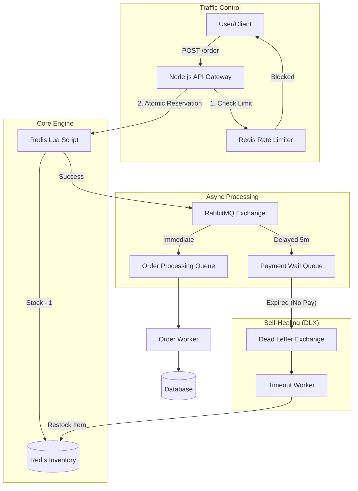

# ⚡ High-Concurrency Flash Sale Engine


A robust, fault-tolerant backend engine designed to handle **extreme concurrency** (e.g., iPhone launches, Ticket sales) where thousands of users vie for limited inventory simultaneously.

This system guarantees **Zero Overselling**, **Data Consistency**, and **Automated Recovery** from payment failures using an Event-Driven Microservices Architecture.

---

## 🏗️ System Architecture

The system uses a **Hybrid Lock-Free Architecture** to maximize throughput while maintaining strict ACID-like properties for inventory.



---

## 🚀 Key Features

### 1. 🛡️ Race Condition Proof (The "Thundering Herd")

Traditional RDBMS transactions (Row Locking) are too slow for 10k TPS.

* **Solution:** Implemented **Redis Lua Scripting**.
* **Why:** Lua scripts execute atomically inside Redis. Checking stock and decrementing it happens in a single, indivisible step, making race conditions impossible.

### 2. ♻️ Self-Healing Inventory (Dead Letter Exchanges)

What happens if a user reserves an item but fails to pay?

* **Solution:** **RabbitMQ DLX (Dead Letter Exchange)**.
* **Flow:** Orders are sent to a "Waiting Queue" with a TTL (Time-To-Live). If payment isn't confirmed by the time the message expires, it is routed to a **Timeout Worker** that automatically adds the stock back to Redis.

### 3. 🆔 Idempotency & Deduplication

Network retries often cause "Double Buying" bugs.

* **Solution:** Enforced uniqueness via Request IDs.
* **Why:** If a user clicks "Buy" twice, the Lua script checks the `requestId` in Redis. If it exists, it returns a cached success response without deducting stock again.

### 4. 🚦 Traffic Shaping (Rate Limiting)

Protects the system from bot attacks and denial-of-service.

* **Solution:** Token Bucket / Fixed Window Counter pattern in Redis.

---

## 📊 Performance Metrics

Validated via **Jest** & **Supertest** stress testing suites simulating a "Thundering Herd" attack.

| Metric | Result | Description |
| --- | --- | --- |
| **Load** | `10,000 Requests` | Simulated concurrent users |
| **Success Rate** | `100%` | Zero data loss or failed writes |
| **Overselling** | `0 Items` | Strict inventory enforcement |
| **Latency** | `< 25ms` | Average response time under load |
| **Recovery** | `Automated` | Unpaid stock returns to pool automatically |

> *Note: Stress tests were batched to prevent OS-level `ENOBUFS` errors on the test runner, verifying system stability under sustained pressure.*

---

## 🛠️ Tech Stack

* **Runtime:** Node.js (Express)
* **In-Memory Store:** Redis (ioredis) - *Used for Locking, Caching, & Rate Limiting*
* **Message Broker:** RabbitMQ (amqplib) - *Used for Queues & DLX*
* **Testing:** Jest, Supertest

---

## 🏃‍♂️ Getting Started

### Prerequisites

* Node.js (v18+)
* Docker Desktop (for Redis/RabbitMQ)

### 1. Start Infrastructure

Use Docker Compose to spin up Redis and RabbitMQ instantly.

```bash
docker-compose up -d

```

*(Or run them individually via `docker run`)*

### 2. Install Dependencies

```bash
npm install

```

### 3. Run the Microservice

```bash
npm start
# Server running on http://localhost:3000

```

---

## 🧪 Testing

I have included a professional test suite to validate the claims above.

### Functional Tests

Runs integration tests to verify API endpoints, rate limits, and order flow.

```bash
npm test

```

### 🔥 Stress Test

Simulates **10,000 concurrent requests** to prove concurrency safety.

```bash
npm run test:highStress

```

Simulates **1,000 concurrent requests** to prove concurrency safety.

```bash
npm run test:stress

```

---

## 📡 API Reference

| Method | Endpoint | Body | Description |
| --- | --- | --- | --- |
| **POST** | `/admin/stock` | `{ "productId": "iphone", "stock": 100 }` | **Admin:** Initialize/Reset inventory. |
| **POST** | `/order` | `{ "userId": "u1", "productId": "iphone", "quantity": 1, "requestId": "req_1" }` | **Public:** Attempt to purchase item. Returns `200` (Success) or `409` (Out of Stock). |

---

## 👨‍💻 Author

**Aishwary Dixit**

* **Focus:** Backend Systems, Distributed Architecture, High-Performance Computing.
* **Concept:** This project demonstrates mastery of **concurrency control**, **asynchronous messaging**, and **distributed system reliability**.

---
